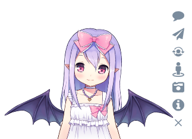
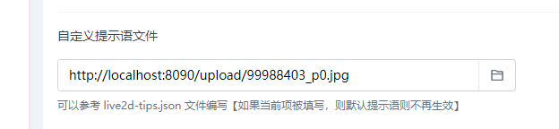

<h1 align="center">Live2d Plugin for Halo</h1>
<p align="center">
  <a href="https://github.com/halo-dev/halo"></a>
  <a href="https://github.com/LIlGG/halo-theme-sakura"></a>
  <a href="https://github.com/prettier/prettier"></a>
  <a href="./LICENSE"></a>
</p>

> 难道不想为您的网站添加一只萌萌的看板娘吗？？ (ノ≧∇≦)ノ |

## 简介
仅仅是一只可爱的看板娘哦！



**注：本仓库仅提供基础渲染框架，不包含任何 Live2d 模型及其接口**

## 下载及使用说明
1. 前往 [Github Release](https://github.com/LIlGG/plugin-live2d/releases/latest) 下载 jar 包
2. 通过 Halo-2.x [安装插件](https://docs.halo.run/user-guide/plugins#%E5%AE%89%E8%A3%85%E6%8F%92%E4%BB%B6) 功能安装本插件
3. 打开网站，即可在左下角看到萌萌哒的看板娘哦~

## 自定义配置
> 此部分内容建议初步尝试过 Live2d 的用户观看。

### 自定义 Live2d 接口
若主题内置接口不满足用户使用，可以参考 [live2d_api](https://github.com/fghrsh/live2d_api) 自行开发接口。

之后修改 `插件配置 -> 基本设置 -> Live2d 模型地址` 即可。

### 自定义 TIPS 文件
[TIPS文件](/src/main/resources/static/live2d-tips.json) 文件是一个 JSON 文件，其内容为 Live2d 消息框对用户各种事件的反馈。
例如当用户鼠标点击网页中的某个链接时，Live2d 的消息框就会呈现出各种各样的文本。而这个绑定事件就是通过 TIPS 文件来处理的。

因此可以说，**TIPS 文件与所用主题强绑定甚至需要用户高度自定义。**

默认的 TIPS 保证了用户的基础使用，但如果想丰富 Live2d，那么就需要自定义 TIPS 文件。本插件提供了多种方式自定义 TIPS。

TIPS 文件格式

```json
{
  "mouseover": [                 // 鼠标移动事件
    "selector": "#live2d",       // css 选择器
    "text": []                   // Live2d 消息框显示内容。为数组则随机选择一条显示
  ],
  "click": [                     // 鼠标点击事件
    "selector": "#live2d",       // css 选择器
    "text": []                   // Live2d 消息框显示内容。为数组则随机选择一条显示
  ],
  "seasons": [                   // 日期事件，当前日期处于目标日期或目标区间内，则进行显示
    "date": "09/10",             // 日期或日期区间。区间使用 - 区分
    "text": []                   // Live2d 消息框显示内容。为数组则随机选择一条显示
  ],
  "time": [                      // 时间事件，到每日固定的时间则进行提示
    "hour": "6-7",               // 时间，小时为单位，需要为区间，例如 6-7 代表 6 点到 7 点之间
    "text": []                   // Live2d 消息框显示内容。为数组则随机选择一条显示
  ],
  "message": {                   // 固定消息，通常代表特定事件
    "default": [],               // 页面空闲时显示的消息
    "console": [],               // 打开控制台时显示的消息
    "copy": [],                  // 复制内容时显示的消息
    "visibilitychange": []       // 多标签页，从其他标签页返回当前标签页时显示的消息
  }
}
```

#### 1. 使用主题提供的 TIPS 文件（推荐）
此功能属于为主题开发者定制。如果用户使用某款主题，但它并未支持此 TIPS 文件，不如向主题作者提交一个 ISSUE 吧！！！

由于 Live2d 的 TIPS 通常需要使用 css 选择器来进行鼠标定位，因此将 TIPS 文件交由主题来适配是最好的方式。

1. 主题开发者可以参考  [主题 TIPS 文件](/assert/live2d/tips.json) 文件来编写适配自己主题的 TIPS 文件。
2. 将 json 文件命名为 `tips.json` 并放置在主题静态目录 `/assert/live2d/` 目录下

live2d 渲染页面时将自动读取当前启用主题下的文件。

**注：主题所适配的 TIPS 只支持 mouseover 及 click 属性，主题提供的 TIPS 文件若与默认 TIPS 文件 css 选择器冲突，则以主题提供的为主**

#### 2. 使用插件配置单独制定 TIPS
当主题开发者未适配 Live2d 或者用户觉得其不太符合自己需求，那么可以使用插件内置的配置文件单独定制 TIPS 文件。

使用 Halo 后台 `插件设置 -> 事件及提示语绑定 -> 选择器提示语` 添加自己想要的提示语。


**注：插件设置的 css 选择器与主题或默认的 TIPS 文件冲突时，将以插件设置的为准**

#### 3. 全量自定义 TIPS 文件
当用户想完全自定义 TIPS 文件或者上述两种方式不满足用户的需求，例如想更改 `seasons, time, message` 属性时，可以采用此种方式。

1. 用户可以参照 [默认 TIPS 文件](/src/main/resources/static/live2d-tips.json) 或者按照 [自定义TIPS文件](#自定义-tips-文件) 中的 TIPS 文件格式来编写 TIPS 文件。
2. 使用 Halo 后台 `插件设置 -> 事件及提示语绑定 -> 自定义提示语文件`，更改对应的文件即可。

> 小提示: 可以将文件上传到 Halo 附件内，再进行选择！



**需要特别注意的是，一旦用户指定了此 TIPS 文件，那么默认的 TIPS 文件将不再生效（除非当前文件加载失败，此时会回退使用默认的 TIPS 文件），因此建议自定义时将属性设置完整**

## 鸣谢
- 本插件代码借鉴了 [live2d-widget](https://github.com/stevenjoezhang/live2d-widget) 的理念及代码并完全重写 JS
- 使用了 [hitokoto](https://hitokoto.cn/) 的一言接口
- 默认使用了 [ZSQIM](https://zsq.im/) 的 live2d 接口
- 纸飞机小游戏源自于 [WebsiteAsteroids](http://www.websiteasteroids.com/)
- Live2d 官方地址 [https://live2d.github.io](https://live2d.github.io)

## 赞助
> 如果您喜欢我的插件，可以考虑资助一下~ 您的支持将是我继续进行开源的动力。

| <br /><b>微信</b><br /> | <br /><b>支付宝</b><br />  | 
| :---: | :---: |

欢迎其他各种形式的捐助！

## 许可证
**plugin-live2d** © [LIlGG](https://github.com/LIlGG)，基于 [MIT](./LICENSE) 许可证发行。<br>

本仓库所使用的接口等版权均属原作者，仅供研究学习，不得用于商业用途，请善待接口。

作者及其贡献者共有版权 （[帮助维护列表](https://github.com/LIlGG/plugin-live2d/graphs/contributors) ）
> [lixingyong.com](https://lixingyong.com) · GitHub [@LIlGG](https://github.com/LIlGG)

## 希望你喜欢！


